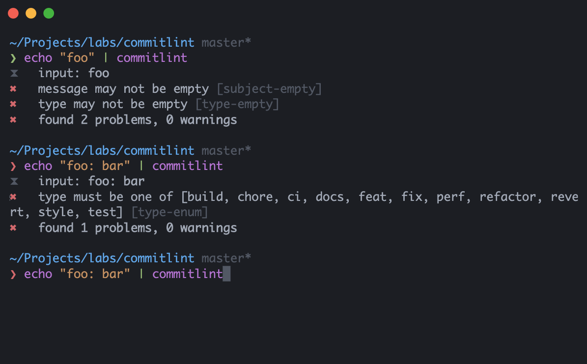

<h1 align="center">🧩 Padrões de Commits</h1>

	

<h2 align="center">
💡 O padrão de commit tem como objetivo aplicar uma estrutura de commit restrita, incentivando commits menores e com um propósito específico.</h2>  

<h3>📝 Sintaxe</h3>

<pre>
<b><a href="#types">&lt;type&gt;</a></b>(<b><a href="#scopes">&lt;optional scope&gt;</a></b>): <b><a href="#subject">&lt;subject&gt;</a></b>
empty separator line
<b><a href="#body">&lt;optional body&gt;</a></b>
empty separator line
<b><a href="#footer">&lt;optional footer&gt;</a></b>
</pre>
 
  

<h3>🏛️ Convenções</h3>

<ul style="list-style:none;">
		<li>📜 A descrição deve ser curta.</li>
		 
		<li>📜 O escopo(scope) fornece informações contextuais adicionais.</li>
		 
		<li>📜 Siga o modo verbal imperativo afirmativo de "Tu"(filtra, envia, converte, remove, come, bebe, deleta, altera, etc) ou inglês present tense(add, improve, implement, change, etc).</li>
		 
		<li>📜 O rodapé(footer) deve conter qualquer informação sobre BREAKING CHANGES e referenciar as issues a que este commit se refere.</li>
		 
		<li>📜 O escopo, corpo e rodapé são opcionais.</li>
		 
		<li>📜 Separe as seções com uma linha em branco.</li>
	</ul>
 

<h3>💎 Tipos</h3>

 <table>
	 <thead>
		 <th> <h4>✨ feat: Adiciona uma nova feature</h4></th>
	 </thead>
	 <tbody>
		 <tr><td><code>feat: estiliza cabeçalho</code></td></tr>
		 <tr><td><code>feat(auth): requere autenticação de dois fatores</code></td></tr>
		 <tr><td><code>feat(api): envia email ao entregar produto</code></td></tr>
		 <tr><td><code>feat(titles): add title to each type</code></td></tr>
		 <tr><td><code>feat: add axios / busca e trata os dados</code></td></tr>
		 <tr><td><code>feat: support cjs config files</code></td></tr>
		 <tr><td><code>feat(Parser): improve error handling</code></td></tr>
		 <tr><td><code>feat(page/home): cria roteamentento no next</code></td></tr>
		 <tr><td><code>feat(aio): implement 'GithubTeams'</code></td></tr>
		 <tr><td><code>feat(zone.js): support Promise.allSettled</code></td></tr>
	 <tbody>
 </table>
 
 <table>
	 <thead>
		 <th> <h4>🔧 fix: Fixa um bug</h4></th>
	 </thead>
	 <tbody>
		 <tr><td><code>fix(footer): alinha botão</code></td></tr>
		 <tr><td><code>fix: bug impedindo submeter o formulário</code></td></tr>
		 <tr><td><code>fix: loop infinito na linha 88</code></td></tr>
		 <tr><td><code>fix: "isFunction" to match "asyncFunction"s and "Function"s</code></td></tr>
		 <tr><td><code>fix(Travis): broken build</code></td></tr>
		 <tr><td><code>fix: destructuring warning message</code></td></tr>
		 <tr><td><code>fix: solve page loading problem</code></td></tr>
		 <tr><td><code>fix: import</code></td></tr>
		 <tr><td><code>fix: garante que tags sejam array</code></td></tr>
		 <tr><td><code>fix(service/github): trata eventuais erros na chamada</code></td></tr>
	 <tbody>
 </table>
    
    <table style="text-align: center;">
	 <thead>
		 <th> <h4>♻️ refactor: Modifica código sem adicionar nova feature ou fixar bug</h4></th>
	 </thead>
	 <tbody>
		 <tr><td><code>refactor(subscribe): converte função para arrow function</code
		 ></td></tr>
		<tr><td><code>refactor: altera título da página</code></td></tr>
		<tr><td><code>refactor(DirectiveResolver): cleanup</code></td></tr>
		<tr><td><code>refactor(ivy): remove need for LContainer.template (#24335)</code></td></tr>
		<tr><td><code>refactor(core): remove deprecated 'bootstrap' (#10831)</code></td></tr>
		<tr><td><code>refactor(ShadowCss): cleanup</code></td></tr>
		<tr><td><code>refactor(aio): remove redundant styles</code></td></tr>
		<tr><td><code>refactor: change to use diff instead of status</code></td></tr>
	 <tbody>
 </table>
    
     <table style="text-align: center;">
	 <thead>
		 <th> <h4>❌ revert: Reverte commit</h4></th>
	 </thead>
	 <tbody>
		 <tr><td><code>revert: mudança que adiciona feature x</code>   <code>ref: a215398</code></td></tr>
		<tr><td><code>revert: "docs(README): describe convertions origin"</code>  <code>This reverts commit eb68d3d.</code></td></tr>
	 <tbody>
 </table>
  
    <table style="text-align: center;">
	 <thead>
		 <th> <h4>👨‍🏭 ci: Indica mudança relacionada a integração contínua (Travis, Circle, BrowserStack, SauceLabs...)</h4></th>
	 </thead>
	 <tbody>
		 <tr><td><code>ci: modifica dockerfile</code
		 ></td></tr>
		<tr><td><code>ci(azure-pipelines.yml): change Ubuntu VM to 'latest' (#860)</code></td></tr>
		<tr><td><code>ci: add travis</code></td></tr>
	 <tbody>
 </table>
 
<table style="text-align: center;">
	 <thead>
		 <th> <h4>✅ test: Adiciona testes ou corrige testes existentes</h4></th>
	 </thead>
	 <tbody>
		 <tr><td><code>test(compiler-cli): add test for missing translation parameter</code
		 ></td></tr>
		<tr><td><code>test: add attribute interpolation test</code></td></tr>
		<tr><td><code>test: split out provider tests</code></td></tr>
		<tr><td><code>test: add assert for message with scope</code></td></tr>
		<tr><td><code>test(docs-infra): fix tests (#26202)</code></td></tr>
		<tr><td><code>test: add hook render and copy() trigger</code></td></tr>
	 <tbody>
 </table>
 
  <table style="text-align: center;">
	 <thead>
		 <th> <h4>⚡ perf: Indica mudanças que melhoram a performance</h4></th>
	 </thead>
	 <tbody>
		 <tr><td><code>perf(ivy): don't store public input names in two places</code
		 ></td></tr>
		<tr><td><code>perf(ivy): remove check for function type in renderStringify</code></td></tr>
		<tr><td><code>perf(ivy): remove generation of comments</code></td></tr>
		<tr><td><code>perf(change detection): minimize amount of code in protective try-catch</code></td></tr>
		<tr><td><code>perf(docs-infra): avoid unnecessary I/O operation in 'ng-packages-installer'</code></td></tr>
		<tr><td><code>perf(dom): send values only for existing properties to js interior</code></td></tr>
	 <tbody>
 </table>
   
    <table style="text-align: center;">
	 <thead>
		 <th> <h4>📃 docs: Identifica mudanças sobre documentação</h4></th>
	 </thead>
	 <tbody>
		 <tr><td><code>docs: documenta a função bar</code
		 ></td></tr>
		<tr><td><code>docs: adiciona exemplos de uso de foobar</code></td></tr>
		<tr><td><code>docs: remove palavra repetida "foo"</code></td></tr>
		<tr><td><code>docs(zone.js): update DEVELOPER.md for changelog instruction</code></td></tr>
		<tr><td><code>docs(readme): remove incorrect download count badge</code></td></tr>
		<tr><td><code>docs(core): fix API docs for ContentChild and ViewChildren</code></td></tr>
		<tr><td><code>docs(MockConnection): add mockError usage example</code></td></tr>
		<tr><td><code>docs(router): clarify scroll position wording</code></td></tr>
		<tr><td><code>docs(README): remove redundant link</code></td></tr>
		<tr><td><code>docs(README): fix npm badge</code></td></tr>
	 <tbody>
 </table>
  
     <table style="text-align: center;">
	 <thead>
		 <th> <h4>💄 style: Modifica o código sem afetar o seu significado(white-space, formatação, ponto e vírgula, aspas, etc)</h4></th>
	 </thead>
	 <tbody>
		 <tr><td><code>style: converte tabs para spaces</code
		 ></td></tr>
		<tr><td><code>style(javascript): remove ponto e vírgula</code></td></tr>
		<tr><td><code>style(aio): add space between .home and .hamburguer</code></td></tr>
		<tr><td><code>style(aio): fix indentation on location service</code></td></tr>
		<tr><td><code>style(changelog): improve readability</code></td></tr>
		<tr><td><code>style(bazel): fix 2 unformatted .bzl files</code></td></tr>
		<tr><td><code>style(nodeTree): fix formatting</code></td></tr>
		<tr><td><code>style: fix linter errors</code></td></tr>
		<tr><td><code>style: semantic change</code></td></tr>
	 <tbody>
 </table>
    
        <table style="text-align: center;">
	 <thead>
		 <th> <h4>👷 build: Identifica mudanças relacionadas ao sistema de compilação (envolvendo scripts, configurações ou ferramentas) e dependências de pacotes</h4></th>
	 </thead>
	 <tbody>
		 <tr><td><code>build(deps): bump terser from 5.14.0 to 5.14.2</code
		 ></td></tr>
		<tr><td><code>build(npm): update fsevents to 1.0.14</code></td></tr>
		<tr><td><code>build(tsc-wrapped): use tsickleCompilerHost for initial file load</code></td></tr>
		<tr><td><code>build(docs-infra): update @angular/cli to 9.0.0-rc.0</code></td></tr>
		<tr><td><code>build(common): don't generate .d.ts & .metadata.json files for i18n locales</code></td></tr>
		<tr><td><code>build(docs-infra): update webpack-cli to 3.1.2</code></td></tr>
		<tr><td><code>build: update @schematics/update</code></td></tr>
		<tr><td><code>build: fix nodejs version</code></td></tr>
		<tr><td><code>build: update package version</code></td></tr>
	 <tbody>
 </table>
  
         <table style="text-align: center;">
	 <thead>
		 <th> <h4>⚙️ chore: Não se encaixa em nenhum outro tipo de commit, geralmente identifica mudanças de configurações, manuseamento de arquivos e bibliotecas</h4></th>
	 </thead>
	 <tbody>
		 <tr><td><code>chore: altera o .gitignore</code
		 ></td></tr>
		<tr><td><code>chore: improve commands file</code></td></tr>
		<tr><td><code>chore: improve git file</code></td></tr>
		<tr><td><code>chore: disable extensions when debugging</code></td></tr>
		<tr><td><code>chore: initial commit</code></td></tr>
		<tr><td><code>chore: create file to work with Git</code></td></tr>
		<tr><td><code>chore(eslint): obriga o uso de aspas duplas no jsx</code></td></tr>
		<tr><td><code>chore: add commitlint e husky</code></td></tr>
		<tr><td><code>chore: add examples to eslint ignore</code></td></tr>
	 <tbody>
 </table>
  
         <table style="text-align: center;">
	 <thead>
		 <th> <h4>⚠️ BREAKING CHANGE: O commit que tem um rodapé "BREAKING CHANGE:", ou anexa um ! após o tipo/escopo, introduz uma alteração importante na API e pode fazer parte de qualquer tipo de commit.</h4></th>
	 </thead>
	 <tbody>
		 <tr><td><code>chore!: drop support for Node 6</code>   <code>BREAKING CHANGE: use javascript features not available in Node 6</code></td></tr>
		 <tr><td><code>feat: allow provided config object to extend other configs</code>  <code>BREAKING CHANGE: `extends` key in config file is now used for extending other config files</code></td></tr>
	 <tbody>
 </table>
  
    
<h3>🪛 Existem algumas ferramentas úteis para implementar e automatizar esses commits</h3>
 
Commitizen possibilita impor um formato de mensagem de commit utilizando a linha de comando.

 
 
[commitlint](https://commitlint.js.org/#/) verifica se a mensagem de commit está dentro dos padrões pré definidos e também permite criar o nosso próprio padrão de commit. A documentação ensina a automatizar o lint no projeto.

 

🔌 Extensões do Visual Studio Code que auxiliam na criação de um commit padronizado:

[Git Commit Plugin](https://marketplace.visualstudio.com/items?itemName=redjue.git-commit-plugin) 

[VSCode Conventional Commits](https://marketplace.visualstudio.com/items?itemName=vivaxy.vscode-conventional-commits)

[Commit Message Editor](https://marketplace.visualstudio.com/items?itemName=adam-bender.commit-message-editor)
 
## References
* https://www.conventionalcommits.org/
* http://karma-runner.github.io/1.0/dev/git-commit-msg.html
* https://nitayneeman.com/posts/understanding-semantic-commit-messages-using-git-and-angular/
* https://gist.github.com/qoomon/5dfcdf8eec66a051ecd85625518cfd13
 
